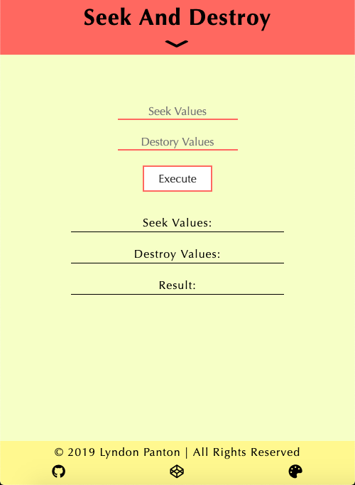
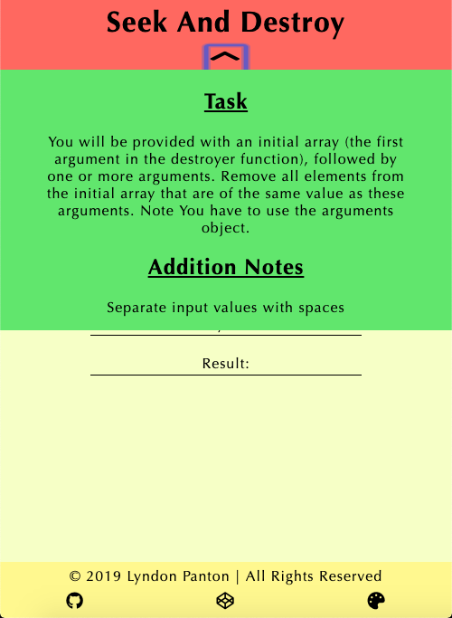
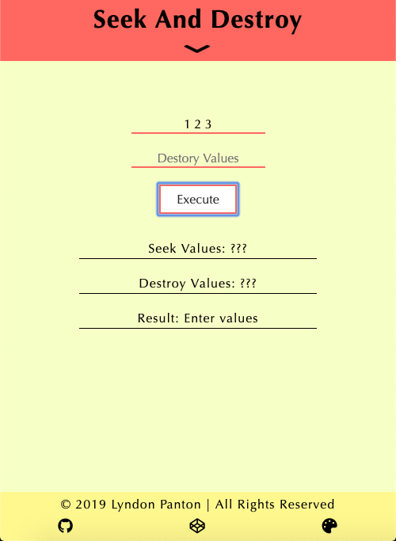
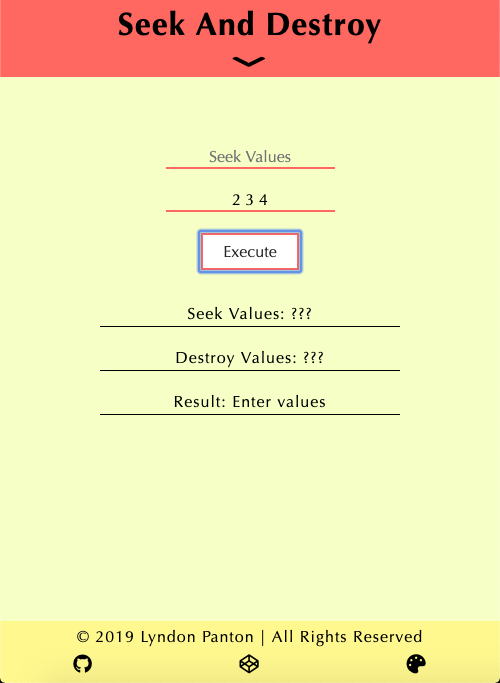
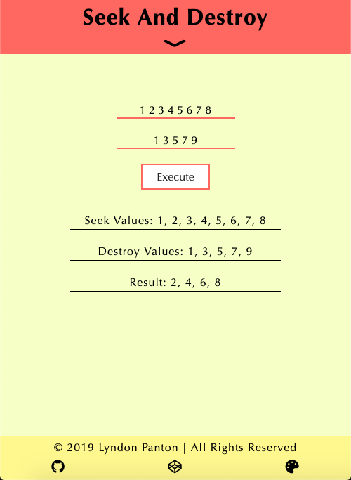
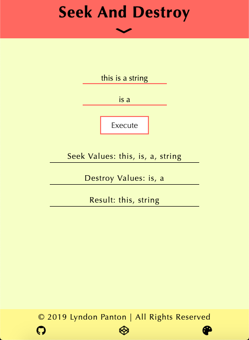

# Seek And Destroy

## How To Open
> 1. Go to the application's folder
> 2. Right click on the file named _index.html_
> 3. Choose the _open with_ option
> 4. Open the application in your desired browser

## How To Use
> 1. Enter values into the first input field
> 2. Enter values into the second input field
> 3. Press the _Execute_ button
> 4. The values from the first input will be displayed, the values from the second input will be displayed, the values in the first input which are not in the second input will be displayed

## Requirements
> 1. This application requires a browser to run
> 2. The browser must have JavaScript available and enabled

## Errors
> 1. N/A

## Preview

